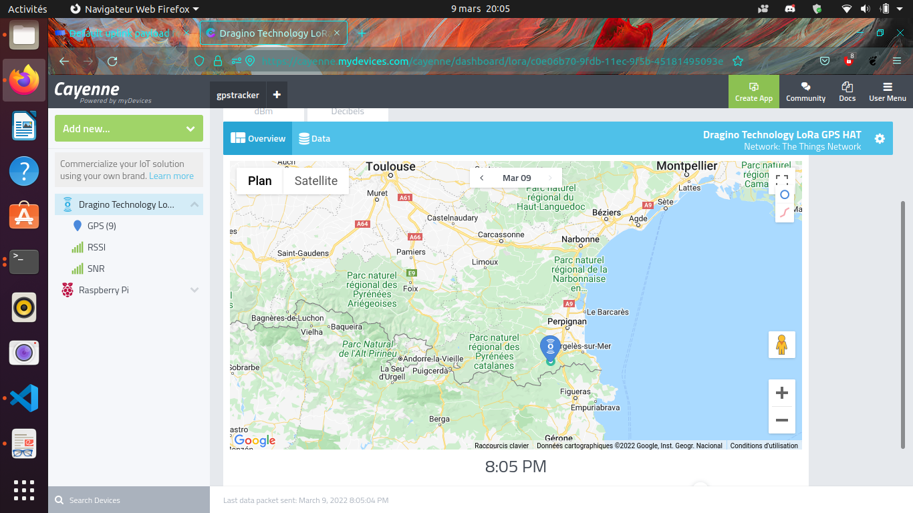

# Setting up a GPS tracker via LoRa(Wan)


ISO : https://drive.google.com/file/d/1YTdmb8JlvePSKiniwBKYyqXx-m-NhzIe/view?usp=sharing

## Installing the router on the Internet (via WiFi)

N.B.: Why via WiFi? In the particular case of the University of Perpignan Via Domitia, the FireWall "does not like" connections on port 1700 necessary to establish the router -> TheThingsNetwork connection.

- It is connected to the mains via USB-C 5V-2A
a WiFi dragino-XXXXXX network appears. 
- We connect to this network via the default password of the router:
"dragino+dragino" (without the quotes)
- On the browser we go to the IP 10.130.1.1 an Id/MdP couple is requested by the dragino (by default) "root" / "dragino
- For the WiFi Client (The dragino provides a web server but is not connected to the Internet!) We click on Enable WiFi-Wan Client with the SSID/MdP pair of a smartphone for example.
  


## Routing LoRa packets to TheThingsNetwork

- Create a TheThingsNetwork.org account (free, you have to provide your email)
- You can see the default router ID (the EUI Gateway) on the LoRa tab of the router web server (10.130.1.1)
- In addition, you have to choose TheThingsNetwork v3 on the drop-down menu below (v2 is available on the router but TheThingsNetwork which maintains its version 2 for old routers does not allow the creation of new routers in v2)
- You must also choose eu1.cloud.thethings.network on the second drop down menu below.


The Router ID (Gateway EUI) must be the same as in the previous configuration. The GatewayID is free but must be unique on ttn and therefore available. The Gateway Name is completely free.
Finally, the Gateway Server Address must correspond to the previous one, i.e. for Europe :
eu1.cloud.thethings.network

The rest of the options can be left by default or changed (if you know why ;))

That's it, you have your router connected to the LoRaWan.


## Preparing the RaspberryPi (the connected object)

A raspberry is a microcomputer about the size of a CB with the power of a smartphone and electrical input/output pins. The operating system of this hardware is (in general and in this study, otherwise it can be via NetBoot, USB, HDD, emmc) on an SD card prepared for example as follows:

### The SD card :

Download Raspi-Imager from the official Raspberry website
https://www.raspberrypi.com/software/

To install raspi-imager on a recent ubuntu host computer simply open a command window (Ctrl-Alt-T) and type

```bash
sudo snap install rpi-imager
```

Then select the following OS (Debian Bullseye the first in the list and the last existing at the time of writing)


and select the following options

ssh: username/password (hint: "pi"/"raspberry")
Wifi : the WiFi of the phone or any other one you have access to
optional : set hostname = raspberry.local


Then we select the media we are going to write to and we choose to write.

We put the card once finished that's it the raspberry should run with an OS. We can check via HDMI on a screen. Or if you want you can ssh access if the computer is on the same local network as the raspberry.
If the network is 192.168.1.0/24 you need to do

```bash
nmap 192.168.1.1-254 -p 22
```

to find out the rpi address. Or if you don't know the gateway ip bytes

```bash
sudo arp -a
```

Finally, to access a shell on the same rpi 

```bash
ssh pi@ip_of_the_pi_previously_found
```

or 

```bash
ssh pi@raspberrypi.local
```

### Installing and configuring the Dragino Hat (GPS/LoRa) on the raspberry 

Once on the rpi shell as always:

```bash
sudo apt update && sudo apt upgrade
```

Then we install the necessary packages:

```bash
sudo apt install git device-tree-compiler git python3-crypto python3-nmea2 python3-rpi.gpio python3-serial python3-spidev python3-configobj gpsd libgps-dev gpsd-clients python3-pip
pip3 install simplecayennelpp
git clone https://github.com/bbaranoff/libgps
cd libgps
make 
sudo make install
sudo ldconfig
nano /etc/default/gpsd
```

```
# Default settings for the gpsd init script and the hotplug wrapper.

# Start the gpsd daemon automatically at boot time
START_DAEMON="true"

# Use USB hotplugging to add new USB devices automatically to the daemon
USBAUTO="false"

# Devices gpsd should collect to at boot time.
# They need to be read/writeable, either by user gpsd or the group dialout.
DEVICES="/dev/ttyAMA0"

# Other options you want to pass to gpsd
GPSD_OPTIONS="-n"
```

Then we add the following lines to /boot/config.txt:

```
enable_uart=1
dtoverlay=miniuart-bt
dtoverlay=spi-gpio-cs
```
Change the /boot/cmdline.txt file to

```
dwc_otg.lpm_enable=0 console=tty1 root=/dev/mmcblk0p2 rootfstype=ext4 elevator=deadline fsck.repair=yes rootwait
```

Then in /home/pi

```bash
git clone https://github.com/computenodes/dragino
cd dragino/overlay
dtc -@ -I dts -O dtb -o spi-gpio-cs.dtbo spi-gpio-cs-overlay.dts
sudo cp spi-gpio-cs.dtbo /boot/overlays/
sudo reboot
```

Then in /home/pi we create the file gpscron as :

```bash
#!/bin/bash
sudo python3 /home/pi/dragino/test_cayenne.py
```
in /home/pi/dragino we write the file test_cayenne.py as :

```python
#!/usr/bin/env python3
"""
    Test harness for dragino module - sends hello world out over LoRaWAN 5 times
"""
import logging
from datetime import datetime
from time import sleep
import RPi.GPIO as GPIO
from dragino import Dragino
#import subprocess
import gpsd
from simplecayennelpp import CayenneLPP # import the module required to pack th$
import binascii
# importing the module
# connect to the local gpsd
gpsd.connect()
packet = gpsd.get_current()
# See the inline docs for GpsResponse for the available data
print(packet.position())
lat = packet.lat
lon = packet.lon
alt = packet.alt

print (lat, lon, alt)
lpp = CayenneLPP()
lpp.addGPS( 1, lat, lon, alt)
text=binascii.hexlify(lpp.getBuffer()).decode()
sent=list(binascii.unhexlify(text))
print(text)
logLevel=logging.DEBUG
logging.basicConfig(filename="test.log", format='%(asctime)s - %(funcName)s - %(lineno)d - %(levelname)s - %(message)s', level=logLevel)
D = Dragino("/home/pi/dragino/dragino.ini", logging_level=logLevel)
D.join()
while not D.registered():
    print("Waiting for JOIN ACCEPT")
    sleep(2)
for i in range(0, 2):
    D.send_bytes(sent)
    start = datetime.utcnow()
    while D.transmitting:
        pass
    end = datetime.utcnow()
    print("Sent GPS coordinates ({})".format(end-start))
    sleep(1)
```

We take the /home/pi/dragino/dragino.ini.default file and rewrite it to /home/pi/dragino/dragino.ini as follows

```
gps_baud_rate = 9600
gps_serial_port = /dev/ttyS0
gps_serial_timeout = 1
gps_wait_period = 10

#LoRaWAN configuration
spreading_factor = 7
max_power = 0x0F
output_power = 0x0E
sync_word = 0x34
rx_crc = True
#Where to store the frame count
fcount_filename = .lora_fcount

##Valid auth modes are ABP or OTAA
##All values are hex arrays eg devaddr = 0x01, 0x02, 0x03, 0x04
#auth_mode = "abp
#devaddr = 
#nwskey = 
#appskey =

auth_mode = otaa
deveui = 0xFF, 0xFE, 0xFD, 0xFC, 0xFC, 0xFD, 0xFE, 0xFF
appkey = 0x70, 0xB3, 0xD5, 0x00, 0x00, 0xD5, 0xB3, 0x70
appkey = 0x3D, 0x83, 0xC3, 0x16, 0x2C, 0xAD, 0x44, 0xB7, 0xB0, 0x50, 0x6C, 0x3C, 0xA1, 0x54, 0x36, 0xB7
```

When choosing the deveui, call them in such a way that they are unique on ttn. And the appkey with enough entropy that it cannot be brute-forced.

Finally to run the python script every minute:

```bash
sudo crontab -e
```
Select your favourite editor
and add the line

```
* * * * * /home/pi/gpscron
```

at the end of the file.
On the raspberry side everything should be ready now

## Connect the object to the LoRaWan (thethingsnetwork)

We go in applications we create an application then we go in enddevices and we choose + Add Endevice


Then we choose the parameters of the object (AppEUI, DevEUI, AppKey) so that they correspond to those established previously in /home/pi/dragino/dragino.ini

i.e. in the example of this study :

```
deveui = 0xFF, 0xFE, 0xFD, 0xFC, 0xFC, 0xFD, 0xFE, 0xFF
appkey = 0x70, 0xB3, 0xD5, 0x00, 0x00, 0xD5, 0xB3, 0x70
appkey = 0x3D, 0x83, 0xC3, 0x16, 0x2C, 0xAD, 0x44, 0xB7, 0xB0, 0x50, 0x6C, 0x3C, 0xA1, 0x54, 0x36, 0xB7
```


Starting the pi (GPS tips and tricks !!!!!)

On the pi shell:

```bash
sudo ntpdate en.pool.ntp.org
```
Put the RPi outside
Unplug the GPS Tx jumper from the Hat dragino power the RPi wait for the 3D fix (the green LED on the dragino, not the RPi) and plug (hot) the Tx jumper.

That should be it you have your first (?) connected object (to LoRaWan)

## Message format

Finally in the case of this study we chose to put the payload in the form CayenneLPP we will see why later. In order for TheThingsNetwork to interpret the payload, it must be told 


To see the object on ttn go to the application you just created select your enddevice and live data you should see something like


## Data management (Cayenne integration)

Go to https://mydevices.com/

Create a Cayenne account

Select TheThingsNetwork


Dragino RPi Hat selection and put the DevEUI




Live data from the GPS tracker !!!!!!!!!!